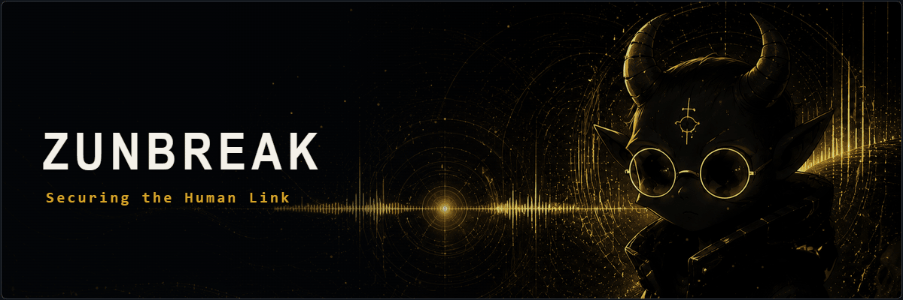
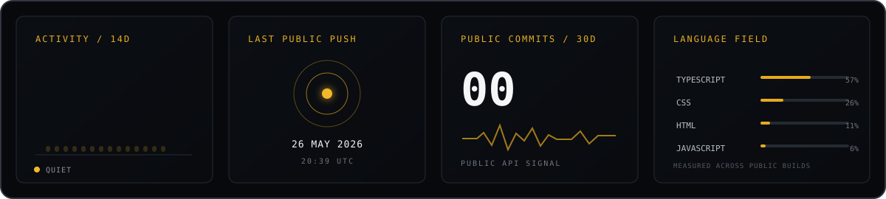

 

### Behind Zunbreak

Zunbreak is a creative technology studio building digital products, interactive experiences and custom software.

I'm Zebastian, the founder behind it. I work across product interfaces, internal tools, real-time 3D and security-focused systems — turning ambitious ideas into things that actually run.

  <a href="https://zunbreak.com">Studio</a> ·
  <a href="https://www.linkedin.com/in/zebastian-zunbreak/">LinkedIn</a>

